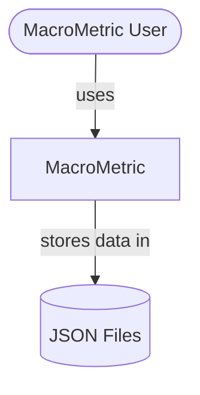
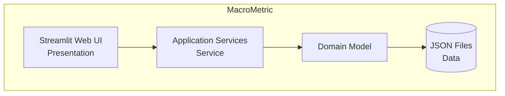
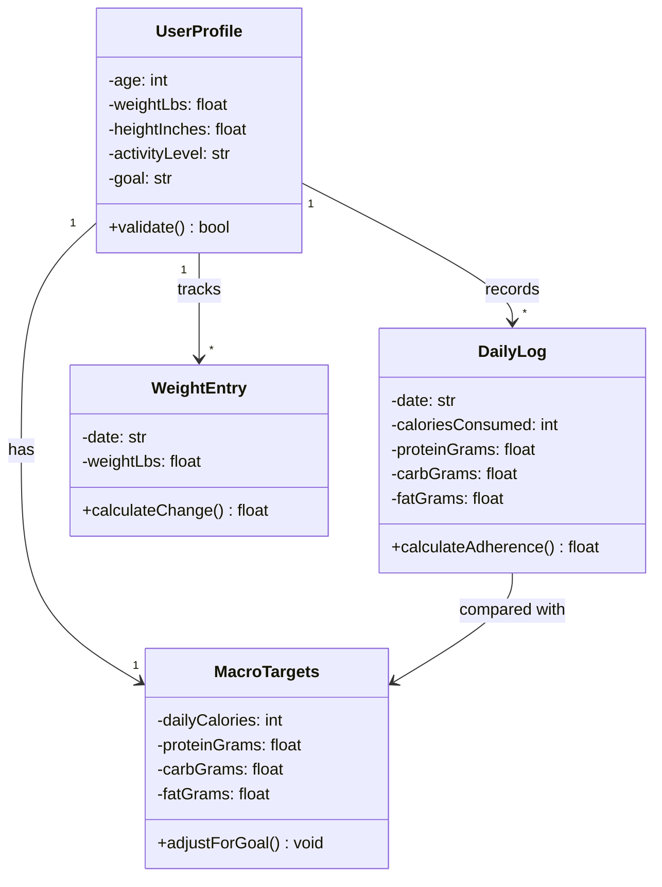
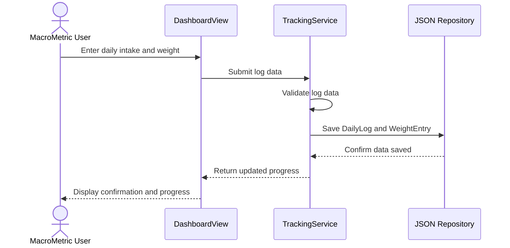

# Project Name: MacroMetric

<!-- CI badge: after Session 4, replace ORG/REPO and the workflow filename, then uncomment:

-->

**Student:** [Carlos Mendoza] · **Course:** CEN 5064 Software Design, Fall 2026 · **Partner:** [@JMorency13]

## Project (approval paragraph — write this by Sun Aug 30)

[One paragraph: What is the system? Who is it for? What are its 3–4 core features?
This paragraph is your approval request — see the Project Brief, Section 2.]

Project Request: 
MacroMetric is an adaptive calorie and macronutrient planning system for adults seeking to lose, maintain, or gain body weight. Users can calculate personalized calorie and macronutrient targets, record daily weight and calorie intake, and monitor their progress through weekly weight trends. The system will compare actual progress with the user’s selected goal and provide transparent, rule-based recommendations for adjusting calorie targets when necessary.

## How to run

```
[Exact commands to build and run your system from a clean clone.
Update this every time the steps change — your partner and your
instructor will follow it literally on conference days.]
```

## Architecture

### Tier breakdown (Session 2 studio)

| Tier | Responsibilities in THIS system |
|------|--------------------------------|
| Presentation | Utilizing Python and Streamlit, we can grab the user input and display information such as age, weight, height, etc... It should additionally present the user's calorie/macro intake, weekly trends, and recommendations based on what the user would like. Likely modules include: DashboardView, PorgressingView.|
| Service | For the service, this is where we take the user input from MarcoMetric's UI, and begin the calculations. Meaning, if the user inputs that they are currently 150 lbs, but want to gain weight, then displays the recommendation. Likely modules: TrackingService, TargetService. |
| Domain | This layer contains MacroMetric’s core entities and business rules. Entities may include UserProfile, FitnessGoal, MacroTargets, DailyLog, and WeightEntry. Business rules include calculating calorie and macro targets, evaluating weekly weight trends, and determining when recommendations should be generated. |
| Data | This layer handles the storage and retrieval of user profiles, nutrition logs, weight entries, and calculated targets. MacroMetric will use JSON files for local persistence, accessed through repository modules such as ProfileRepository and TrackingRepository. This keeps file-handling logic separate from the service, domain, and presentation layers. |

### C4 — Context & Container (Session 3 studio)





### UML — Class & Sequence (Session 3 studio)





## Architecture Decision Records

Decisions live in [`docs/adr/`](docs/adr/). Start with ADR-001 in Session 4.

| # | Decision | Status |
|---|----------|--------|
| [001](docs/adr/adr-001.md) | [What I am building and why] | [proposed] |

## Weekly log (optional but recommended)

A one-line note per week keeps your commit story readable:

- Week 1 (Aug 24): repo created, three ideas drafted
- Week 2 (Aug 31): ...
